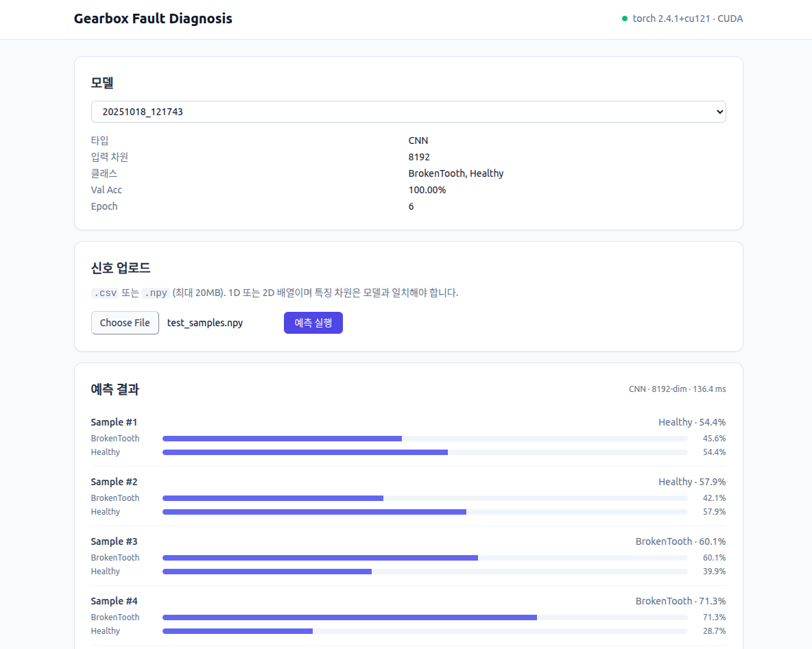

# Gearbox Fault Diagnosis

기어박스 진동 신호에서 고장 유무를 분류하는 프로젝트입니다.

- **Backend**: PyTorch 기반 1D-CNN / ResNet / MLP + FastAPI 추론 서버
- **Frontend**: Vite + React 18 + TailwindCSS 대시보드
- **환경**: miniconda `py310_pt` (Python 3.10 + torch 2.4.1+cu121) / Node 18 LTS

---

## 데모



업로드한 진동 신호(`.csv` / `.npy`)를 선택한 모델로 추론하고, 샘플별 클래스 확률을 시각화합니다.

---

## 디렉토리 구조

```
gearbox-fault-diagnosis/
├── backend/
│   ├── app/                         # FastAPI (추론 API)
│   │   ├── main.py                  # 엔트리 (uvicorn app.main:app)
│   │   ├── schemas.py               # Pydantic v2 모델
│   │   ├── api/{health,models,predict}.py
│   │   └── services/predictor_pool.py   # LRU 캐시 + asyncio.Lock
│   ├── train.py / evaluate.py / inference.py        # 학습·평가·추론 CLI
│   ├── simple_predict.py / test_predict.py          # 추론 편의 스크립트
│   ├── downsample_data.py / visualize.py            # 데이터·결과 유틸
│   ├── models.py / dataset.py / preprocessing.py / utils.py / config.py
│   ├── data/               # Kaggle 원본 (gitignored)
│   ├── data_downsampled/   # 다운샘플링 (8192 차원)
│   ├── results/            # 학습 산출물 (모델·그림)
│   └── requirements.txt
├── frontend/
│   ├── package.json / vite.config.ts / tailwind.config.js
│   └── src/
│       ├── App.tsx / main.tsx / index.css
│       ├── api/client.ts
│       └── components/{ModelSelector,UploadCard,PredictionResult,HistoryTable}.tsx
├── docs/
│   ├── ARCHITECTURE.md     # 시스템 구조·모듈 책임·파이프라인
│   └── UML.md              # 클래스·시퀀스·상태 다이어그램 (Mermaid)
├── README.md / LICENSE
```

---

## 요구사항

| | 버전 |
|---|---|
| Python | 3.10 (`py310_pt` conda env 권장) |
| PyTorch | 2.4.1+cu121 (환경에 이미 설치) |
| Node.js | 18 LTS (18.18 이상) |
| npm | 10.x |

설치 확인:
```bash
conda env list | grep py310_pt
node --version   # v18.x
```

---

## 빠른 시작

### 1. 백엔드 (conda `py310_pt`)

```bash
cd backend
conda activate py310_pt
pip install -r requirements.txt        # fastapi / uvicorn / python-multipart / pydantic 포함

# (선택) 원본 데이터가 있으면 다운샘플링
python downsample_data.py --data_path ./data --target_size 8192

# 모델 1개는 있어야 API가 쓸모가 있습니다
python train.py --data_path ./data_downsampled --model CNN --epochs 50 --amp

# API 기동
uvicorn app.main:app --reload --port 8000
```

Swagger UI: <http://localhost:8000/docs>

### 2. 프런트엔드 (Node 18)

```bash
cd frontend
npm install
npm run dev              # http://localhost:5173 (→ /api 는 :8000 으로 프록시)
```

### 3. 프런트 프로덕션 빌드

```bash
cd frontend
npm run build            # dist/ 에 정적 자산 생성
npm run preview          # 로컬 미리보기
```

배포 시 `frontend/dist/`를 정적 호스팅(Nginx 등) 또는 FastAPI `StaticFiles`로 서빙하면 됩니다.

---

## 주요 CLI (backend/)

```bash
# 학습
python train.py --data_path ./data_downsampled --model CNN --epochs 100 \
                --amp --class_weight

# 평가 (train.py와 동일한 split 재현)
python evaluate.py --model_path results/<ts>/best_model.pth \
                   --data_path ./data_downsampled

# 예측 (파일 입력 필수, 대화형 모드 없음)
python inference.py --model_path results/<ts>/best_model.pth \
                    --input_data test.csv
# 또는 자동으로 최신 모델 사용
python simple_predict.py
```

학습 플래그 요약:
- `--amp` : CUDA Mixed Precision
- `--class_weight` : CrossEntropyLoss 가중치 자동 계산
- `--deterministic` : `cudnn.benchmark=False`로 완전 재현성 (속도 감소)

---

## API 요약

모든 엔드포인트는 `/api` 프리픽스를 사용합니다.

| Method | Path | 설명 |
|---|---|---|
| GET | `/api/health` | torch / CUDA 상태 |
| GET | `/api/models` | 등록된 `model_id` 목록 (newest-first) |
| GET | `/api/models/{model_id}/meta` | 모델 타입·입력 차원·클래스 등 메타 |
| POST | `/api/predict` | multipart: `model_id` + `file` (.csv/.npy) |
| GET | `/api/history?limit=N` | 최근 예측 이력 (인메모리, 최대 100) |

요청 예시:
```bash
curl -F "model_id=<YYYYMMDD_HHMMSS>" -F "file=@sample.npy" \
     http://localhost:8000/api/predict
```

### 방어 로직 (MVP 구현)
- **Path traversal 차단**: `model_id`는 `^\d{8}_\d{6}$` 정규식 + `Path.resolve()` 검증
- **업로드 크기 제한**: 20MB (1MB 청크로 읽으며 초과 시 413)
- **입력 차원 검증**: `scaler.mean_.shape[0]`과 일치해야 함, 불일치 시 400
- **확장자 화이트리스트**: `.csv`, `.npy` 만 허용
- **`.npy` 안전 로드**: `allow_pickle=False` 강제 (코드 실행 방지)
- **동시 추론 직렬화**: predictor별 `asyncio.Lock` + `run_in_threadpool`로 GPU 경합 방지

---

## 개발 팁

- **Vite 프록시**: `frontend/vite.config.ts`에서 `/api` → `http://localhost:8000`. 별도 CORS 설정 불필요.
- **CORS (prod)**: `backend/app/main.py`의 `allow_origins` 갱신 후 재배포.
- **체크포인트 포맷**: `.pth`에 `model_state_dict / scaler / label_names / val_acc / epoch` 포함. 외부 .pth 업로드는 허용 금지 (pickle RCE).
- **이력 휘발**: 단일 사용자 MVP라 서버 재시작 시 `/api/history`는 초기화됩니다.

---

## 문서

- [docs/ARCHITECTURE.md](./docs/ARCHITECTURE.md) — 시스템 구조, 모듈 책임, 학습·추론 파이프라인, 설계 패턴, 보안/확장 포인트
- [docs/UML.md](./docs/UML.md) — 클래스·시퀀스·상태 다이어그램 (Mermaid, GitHub/IDE에서 렌더링)

---

## 라이선스

MIT — [LICENSE](./LICENSE) 참조.
