# Gearbox Fault Diagnosis - UML Diagrams

본 문서는 시스템의 주요 클래스, 시퀀스, 상태 흐름을 Mermaid 기반 UML로 정리한다.
GitHub/IDE의 Mermaid 렌더러에서 그대로 미리보기 가능하다.

---

## 1. 클래스 다이어그램 — ML Core (`backend/`)

### 1.1 모델 (`models.py`)

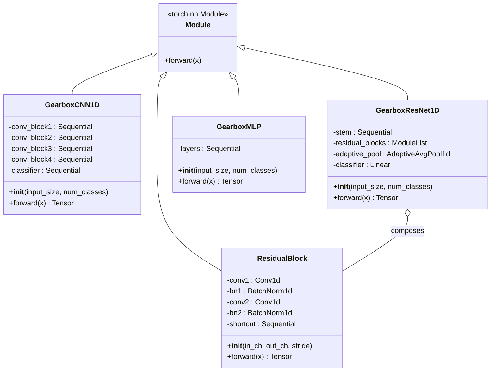

> **Factory**: `get_model(model_name: str, input_size: int, num_classes: int) -> nn.Module`
> — `model_name` 값에 따라 위 세 클래스 중 하나를 반환.

---

### 1.2 데이터 / 전처리 (`dataset.py`, `preprocessing.py`)

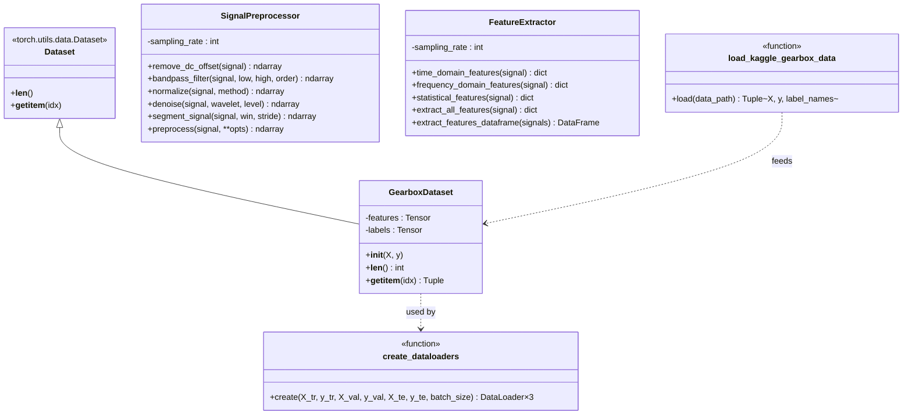

---

### 1.3 학습 / 평가 / 추론 (`utils.py`, `evaluate.py`, `inference.py`)

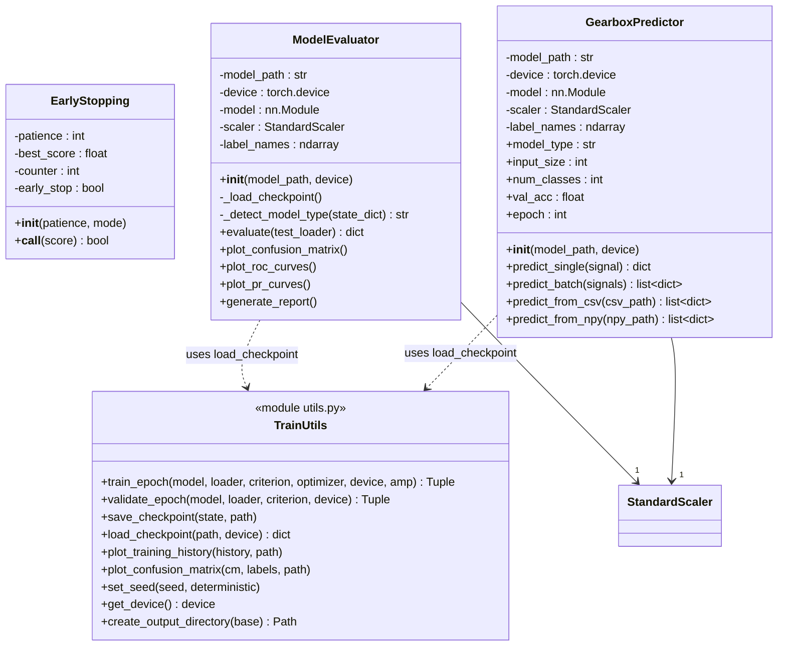

---

### 1.4 설정 (`config.py`)

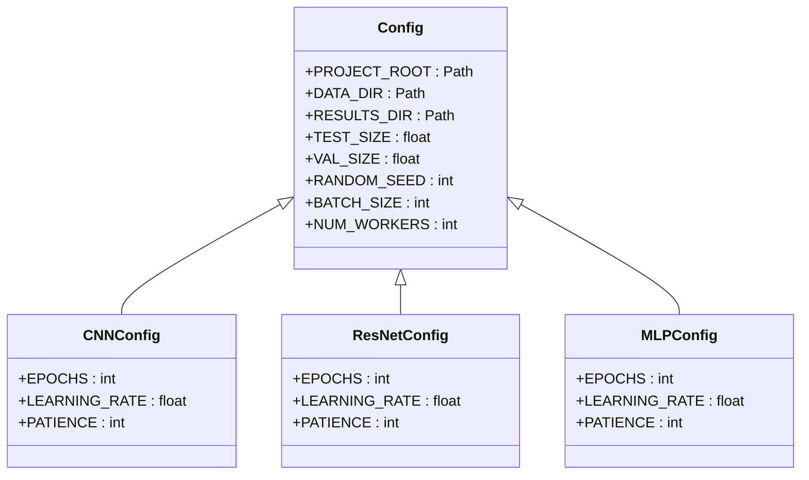

> **Factory**: `get_config(model_type: str) -> type[Config]`

---

## 2. 클래스 다이어그램 — FastAPI Layer (`backend/app/`)

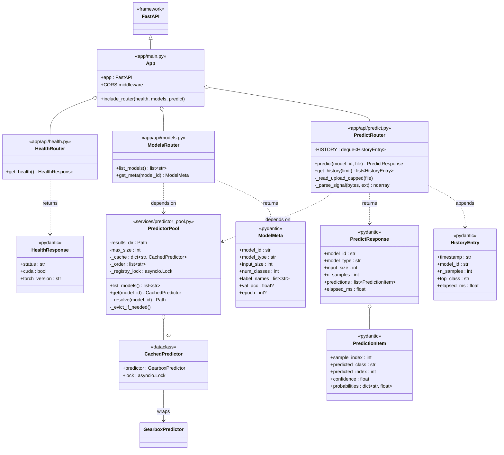

---

## 3. 컴포넌트 다이어그램 — Frontend (`frontend/src/`)

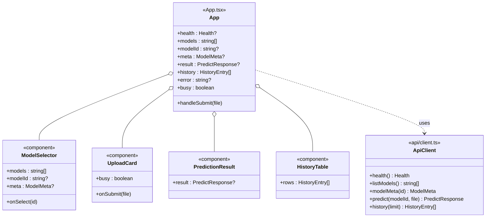

---

## 4. 시퀀스 다이어그램 — 학습 (Training)

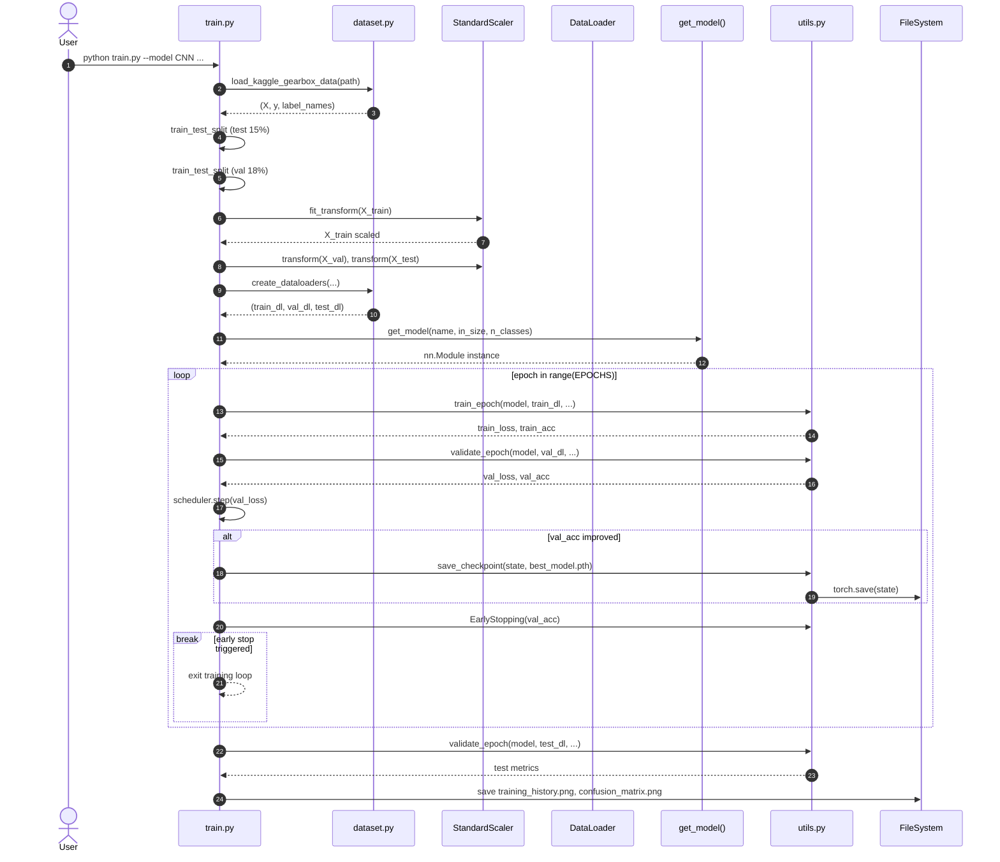

---

## 5. 시퀀스 다이어그램 — 추론 (Web Inference)

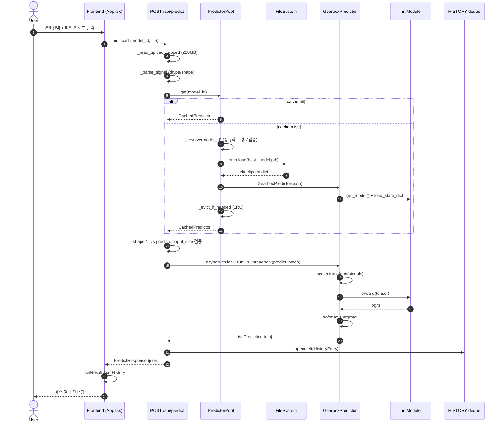

---

## 6. 시퀀스 다이어그램 — 모델 메타 조회

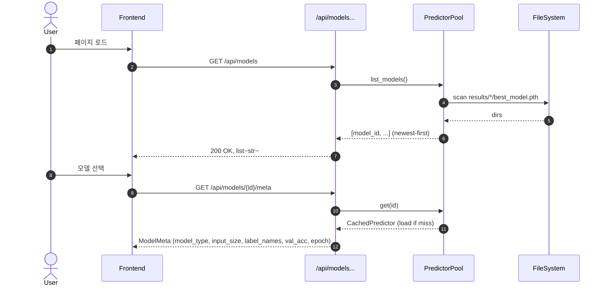

---

## 7. 상태 다이어그램 — `EarlyStopping`

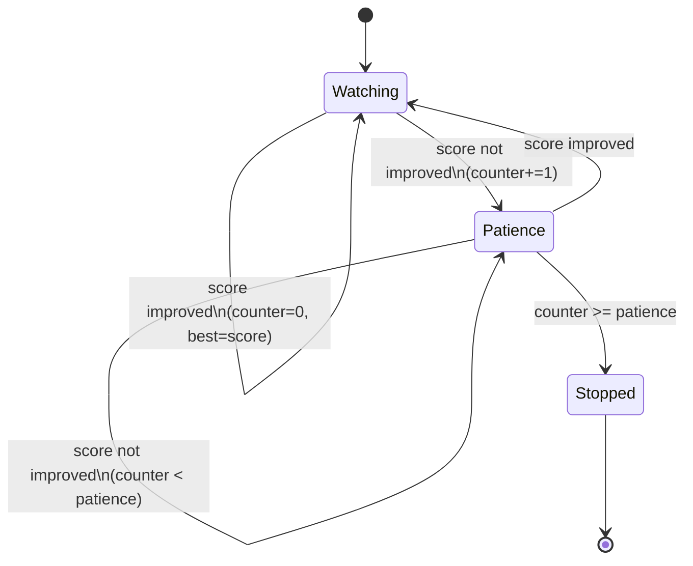

---

## 8. 상태 다이어그램 — `PredictorPool` 캐시 엔트리

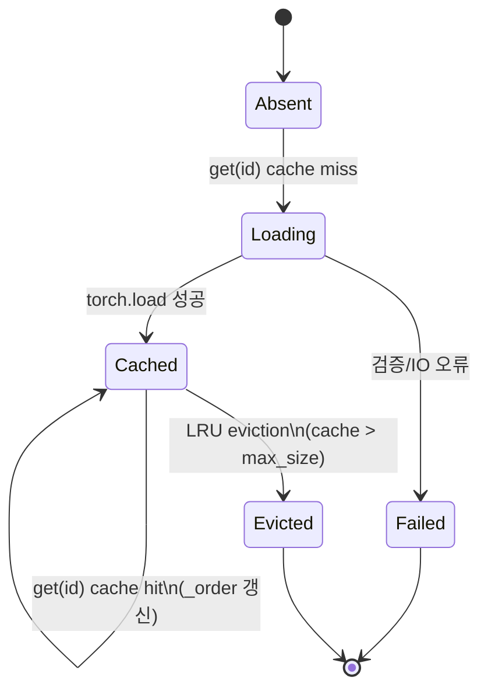

---

## 9. 배포/런타임 컴포넌트 (Deployment)

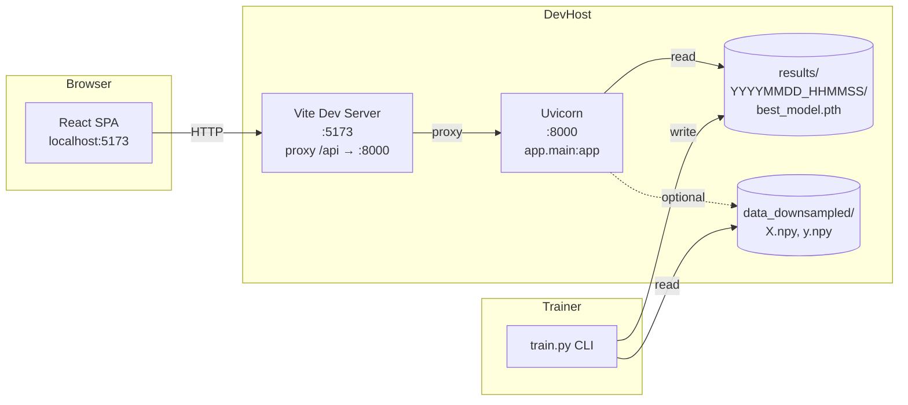

---

## 10. 인터페이스 요약 (REST API)

| Method | Path | Request | Response | 비고 |
|--------|------|---------|----------|------|
| GET | `/api/health` | — | `HealthResponse` | CUDA / torch 버전 |
| GET | `/api/models` | — | `list[str]` | 최신순 model_id |
| GET | `/api/models/{model_id}/meta` | path param | `ModelMeta` | 모델 상세 |
| POST | `/api/predict` | multipart: `model_id`, `file` (.csv/.npy ≤20MB) | `PredictResponse` | per-model lock + threadpool |
| GET | `/api/history?limit=N` | query | `list[HistoryEntry]` | in-memory deque (max 100) |

---

## 11. 다이어그램 렌더링 안내

- 본 문서의 모든 다이어그램은 [Mermaid](https://mermaid.js.org/) 문법으로 작성되어 있다.
- GitHub, GitLab, IntelliJ/PyCharm 최신 버전, VS Code(Markdown Preview Mermaid Support 확장)에서 자동 렌더링된다.
- 별도 PNG/SVG 추출이 필요하면 `mermaid-cli`(`mmdc`)를 사용:
  ```bash
  npx -y @mermaid-js/mermaid-cli -i docs/UML.md -o docs/uml.svg
  ```
